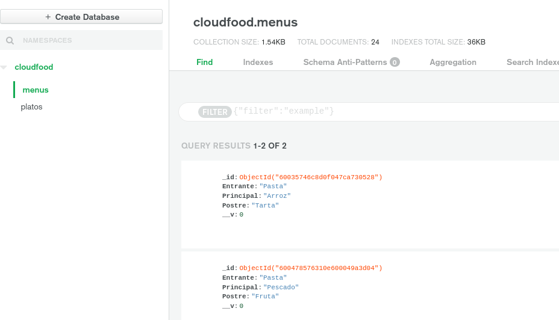
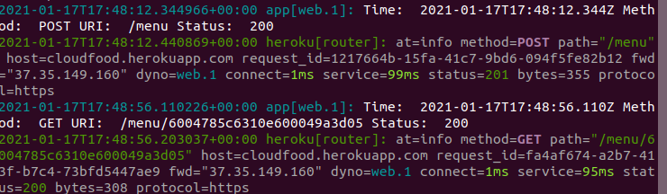

## MongoDB y Logs

Para nuestra app vamos a usar MongoDB como base de datos ya que tenía conocimiento sobre ella y me resultaba sencilla adaptarla a nuestra aplicaciṕn. Como mencioné en la [justificación de herramientas](./just_paas.md), se puede combinar facilmente con Heroku a través de addons.
Para usar Mongo, tenemos que registrarnos en su web y crear un nuevo cluster. Ahí crearemos nuestras colecciones. En mi caso he creado una para almacenar los platos disponibles y otra para almacenar los pedidos realizados. Con el uso de moongose, tenemos nuestra estructura en los archivos [bdmenus](../src/models/bdmenus.js) y [bdplatos](../src/models/bdplatos.js).

Para realizar la conexión he usado dotenv para almacenar la variable de conexión que nos proporciona mongo y la he guardado en un punto .env. En Heroku, la definimos también en el apartado de variables.
Para realizar nuestra conexión, usamos la variable definida, en mi caso CONNECTION:

Aquí podemos ver un ejemplo de nuestra base de datos de pedidos con algunos ya creados a través de nuestra app:

Para los logs, heroku nos proporciona la orden ~~~ heroku logs ~~~. En mi caso tuve un error en el despliegue y tuve que observar los logs para ver que fallaba. Ahi ví que mi app crasheaba y pude corregirlo. Con este comando podemos ver el tipo de petición realizada y a qué ruta, así como el host, el tiempo o el protocolo entre otras cosas. Aquí un ejemplo tras realizar la creación de un menú y su posterior consulta:

## Prueba de prestaciones

Para realizar la prueba de prestaciones, vamos a comparar los tiempos que obtenemos realizando las peticiones a heroku y los que obtuvimos en [hitos anteriores](./express.md) con express a nuestro localhost.

~~~
ab -n100 -c100 http://localhost:puerto/peticion
*Para la creación de menú usamos la opción -T  application/x-www-form-urlencoded*
~~~
#### Express

| Petición | Requests per second | Time per request | Transfer rate |
| -- | -- | -- | -- |
| Get de los todos platos | 2177.32 sec | 45.928 ms | 699.55 Kbytes/sec |
| Consulta de menú especifico | 2303.14 sec | 43.419 ms | 553.29 Kbytes/sec |

#### Heroku

| Petición | Requests per second | Time per request | Transfer rate |
| -- | -- | -- | -- |
| Get de todos los platos | 52.47 sec | 19.060 ms | 53.44 Kbytes/sec |
| Consulta de menú especifico | 72.26 sec | 13.839 ms | 23.78 Kbytes/sec |
