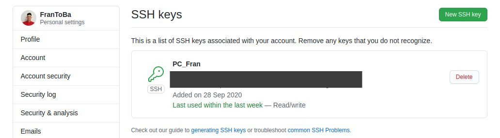
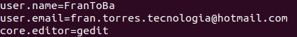

# Configuración inicial

## Creación de par de claves y subida a GitHub
La creación de claves la hacemos de la siguiente forma:
~~~
$ ssh-keygen -t rsa -b 4096 -C "fran.torres.tecnologia@hotmail.com"     //Creamos la clave
$ eval "$(ssh-agent -s)"    //Iniciamos agente ssh en segundo plano
$ ssh-add ~/.ssh/id_rsa     //Agregamos la llave privada SSH al ssh-agent
~~~
Ahora solo tenemos que añadir nuestra clave a GitHUb. Para ello nos vamos al apartado de **Llaves SSH y GPG**, la creamos y la copiamos.
Este es el resultado:

[Tutorial](https://docs.github.com/es/free-pro-team@latest/github/authenticating-to-github/generating-a-new-ssh-key-and-adding-it-to-the-ssh-agent)

## Configuración correcta del nombre y correo electrónico para que aparezca en los commits correctamente
Para la configuración de nombre,correo y editor usaremos las siguientes órdenes:
~~~
$ git config --global user.name "FranToBa"
$ git config --global user.email fran.torres.tecnologia@hotmail.com
$ git config --global core.editor gedit
~~~

[Tutorial](https://git-scm.com/book/es/v2/Inicio---Sobre-el-Control-de-Versiones-Configurando-Git-por-primera-vez)

## Edición del perfil en GitHub 

