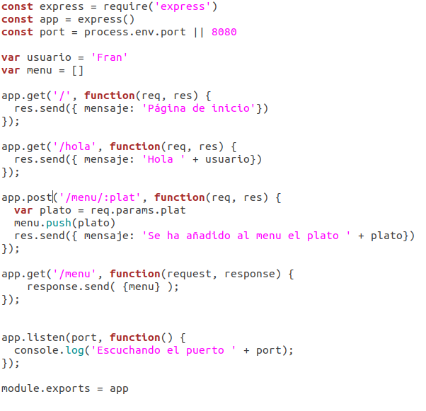
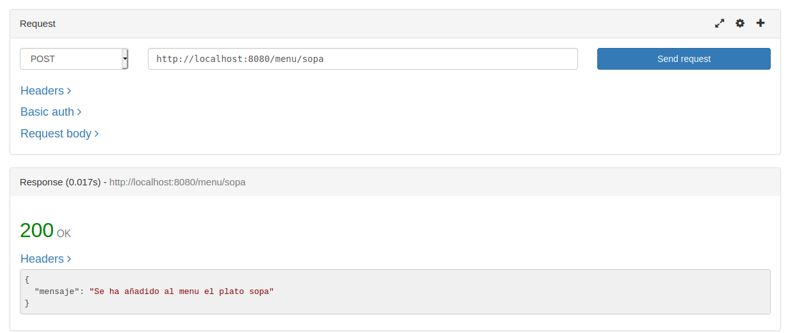
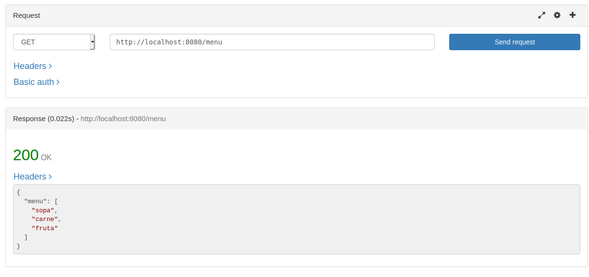

# Justificación y uso de express

#### ¿Por qué Express?

Express es el framework web mas popular de Node, el lenguaje que uso en mi proyecto. Además, este framework sirve de base para muchos otros frameworks del mismo lenguaje. Tras haberlo usado en los ejercicios de autoevaluación, se puede comprobar que su uso es bastante sencillo y permite gestionar el manejo de peticiones por URL facilmente. 

Este framework nos permite manejar facilmente los diferentes verbos de REST, devolver respuesta personalizadas y añadir middlewares (útil para este hito). Podemos encontrar paquetes de middleware de terceros [AQUÍ](https://expressjs.com/es/resources/middleware.html). Además, Express incluye la posibilidad del uso de cookies, sesiones o cabeceras de seguridad entre otras funcionalidades.

Por otra parte, si vamos a stackoverflow, podemos ver la popularidad de este framework frente a otros con un total de 71.683 preguntas, mientras que por ejemplo Roda cuenta con 144 preguntas, o Koa y sinatra con 500. Como vemos, Express es uno de los frameworks más populares y por esto lo he elegido, por la facilidad de su uso y sobre todo por la gran cantidad de información que se puede encontrar si surge alguna duda.

#### Uso de Express

Para mostrar su uso, nos basaremos en el [ejercicio realizado](https://github.com/FranToBa/Autoevaluacion-IV/blob/main/s10/ej2.js) para la autoevaluación:

Como vemos en el código, incluimos el módulo de express y creamos la aplicación. También indicamos el puerto que usaremos que en este caso es el 8080. La función "callback" recoge una petición (req) y uan respuesta (res) como argumentos, y manda la respuesta con un *send*. La última parte del código define el servidor escuchando el puerto indicado y lo muestra por consola.

Se han incluido funciones con GET para mostrar un mensaje de inicio y uno de bienvenida. 
Para el uso de POST, hemos incluido una función que permite incluir un plato a nuestro menú. Usando la extensión *rested* realizamos la petición y nos devuelve el mensaje que esperabamos. 

Tras haber añadido tres platos, podemos usar GET para ver los platos añadidos:

