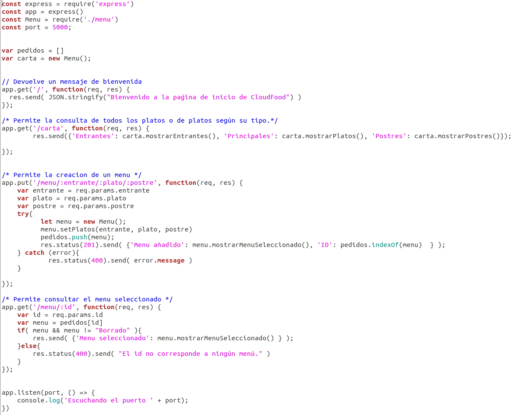
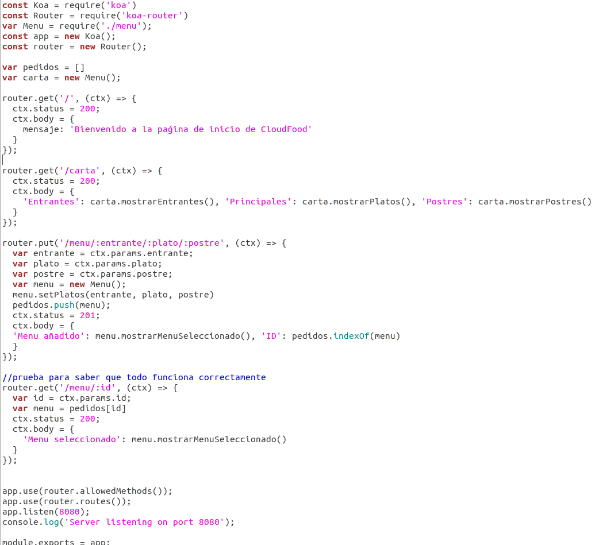

# Justificación y uso de express

#### ¿Por qué Express?

Express es el framework web mas popular de Node, el lenguaje que uso en mi proyecto. Además, este framework sirve de base para muchos otros frameworks del mismo lenguaje. Tras haberlo usado en los ejercicios de autoevaluación, se puede comprobar que su uso es bastante sencillo y permite gestionar el manejo de peticiones por URL facilmente. 

Este framework nos permite manejar facilmente los diferentes verbos de REST, devolver respuesta personalizadas y añadir middlewares (útil para este hito). Podemos encontrar paquetes de middleware de terceros [AQUÍ](https://expressjs.com/es/resources/middleware.html). Además, Express incluye la posibilidad del uso de cookies, sesiones o cabeceras de seguridad entre otras funcionalidades.

Express es el framework más popular ya que cuenta con +43.000 GitHub Stars y 8MM de descargas semanales con npm.

#### ¿Por qué Koa?

Koa es otro framework muy parecido a express (fue desarrollado por el mismo equipo). Es un framework más ligero que Express ya que cuenta solo con 550 lineas de código. Cuenta con un mejor manejo de errores. Sin embargo, mi idea en este proyecto es el uso de middlewares, y Koa se considera libre de middlewares, no compatible con el estilo de Express. 
Además, comparado con express, cuenta con una comunidad más pequeña: cuenta con +25.000 GitHub Stars y 300k de descargas semanales con npm.

#### ¿Por qué HapiJS?

HapiJs es otro framework que permite crear APIS escalables. Permite crear APIS para cliente tanto en aplicacines móviles y en una sola página. Consta de variedad de plugins y librerias. Proporciona disponiblidad de almacenamiento en caché, autenticación y validación de entrada. Este framworks no permite que se utilicen módulos que no sean específicos de Hapi con Joi o boom, los cuales no son compatibles con express.
Cuenta con +11.000 GitHub Stars y +250k de descargas semanales con npm.

## ¿Con cúal/es me quedo?

Basándome en las justificaciones anteriores, voy a realizar las pruebas con Express y con Koa ya que son los más populares y viendo la documentación que proporcionan, se pueden crear APIS con rutas de una forma bastante sencilla.
Para realizar la comparación, voy a crear APIS con las que podremos consultar los platos disponibles, podremos crear un nuevo menú y podremos consultarlo.
Este código será una parte de nuestra API por lo que será explicado con mayor detalle en [este documento](./microapi.md).
Podemos encontrar los siguientes archivos en esta [carpeta](https://github.com/FranToBa/Autoevaluacion-IV/tree/main/pruebas_framework)

#### EXPRESS

Incluimos el módulo de express y creamos la aplicación. También indicamos el puerto que usaremos que en este caso es el 8080. La función "callback" recoge una petición (req) y uan respuesta (res) como argumentos, y manda la respuesta con un *send*. La última parte del código define el servidor escuchando el puerto indicado (5000 en este caso) y lo muestra por consola. 

#### KOA

Para KOA usaremos router, que actuará como middleware para la gestión de las rutas. Comos podemos ver el código es muy parecido a express. En este cas usamos ctx como respuesta e indicamos a nuestra app que use router. En este caso usaremos el puerto 8080.

## Comparación de tiempos

Ahora vamos a comparar los tiempos ejecutano nuestras APIS con las diferentes rutas. Para ello vamos a usar el comando:
~~~
ab -n100 -c100 http://localhost:puerto/peticion
*Para la creación de menú usamos la opción -T  application/x-www-form-urlencoded*
~~~
#### Express

| Petición | Requests per second | Time per request | Transfer rate |
| -- | -- | -- | -- |
| Get de los platos | 2177.32 sec | 45.928 ms | 699.55 Kbytes/sec |
| Creación del menú | 2344.28 sec | 42.657 ms | 931.76 Kbytes/sec |
| Consulta del menú | 2303.14 sec | 43.419 ms | 553.29 Kbytes/sec |

#### KOA

| Petición | Requests per second | Time per request | Transfer rate |
| -- | -- | -- | -- |
| Get de los platos | 3462.72 sec | 28.879 ms | 892.73 Kbytes/sec |
| Creación del menú | 2837.52 sec | 35.242 ms | 504.33 Kbytes/sec |
| Consulta del menú | 3519.14 sec | 28.416 ms | 762.94 Kbytes/sec |

Como podemos observar, Koa es algo más rapido. Sin embargo, ya que nuestra app es simple y **no hay una gran diferencia de tiempos** usaré Express, ya que consta de más popularidad y una mayor comunidad por si me surge algún problema, además de adaptarse perfectamente a los requisitos de nuestro proyecto.

