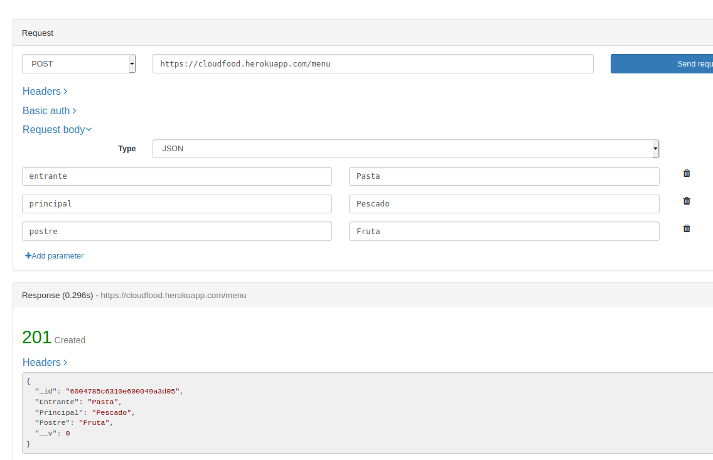
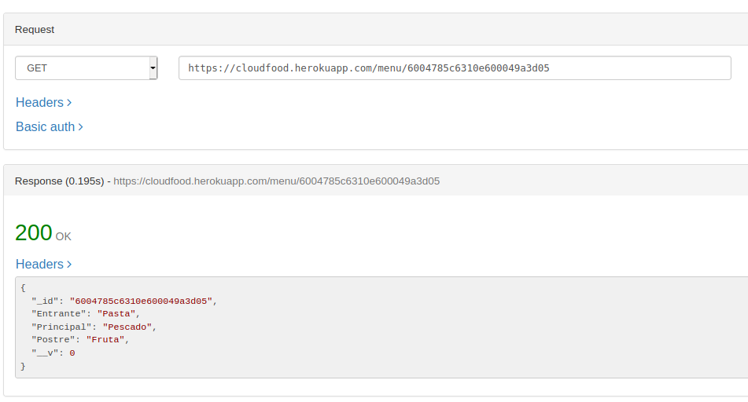
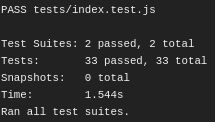

# Funcionamiento correcto y buenas prácticas PaaS

Hemos implementado las rutas existentes anteriormente que incluyen consulta, inserción, modificación y borrado adaptándola a la base de datos.

Las funciones implementas son las siguientes (se pueden consultar [aquí](../src/index.js)):

- GET /status: nos devuelve estado 200.
- GET /carta, /carta/entrantes, /carta/principales, /carta/postres: nos devuelve los platos disponibles y por tipo. [HU01: como usuario quiero consultar los menús disponibles](https://github.com/FranToBa/CloudFood/issues/2).
-POST /menu: permite añadir un nuevo menu. [HU02: como usuario quiero seleccionar menú](https://github.com/FranToBa/CloudFood/issues/3).
- GET /menu/id, POST /menu/id, DELETE /menu/id: permite la consulta, modificación y borrado de un menú. [HU03: como usuario quiero modificar el menú seleccionado](https://github.com/FranToBa/CloudFood/issues/4)
- GET /carta/precios, /carta/precios/plato, /carta/precios/tipo: devuelve los precios de todos los platos, filtrados por el nombre del plato o por el tipo. [HU06: Como usuario quiero consultar el precio de los platos](https://github.com/FranToBa/CloudFood/issues/22)

Podemos probarlo usando nuestro despliegue de heroku a través de [https://cloudfood.herokuapp.com/](https://cloudfood.herokuapp.com/).

Aquí algunos ejemplos de consulta y creación:

Además, podemos comprobar el correcto funcionamiento al comprobar que pasa nuestros tests desde travis:

