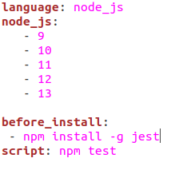
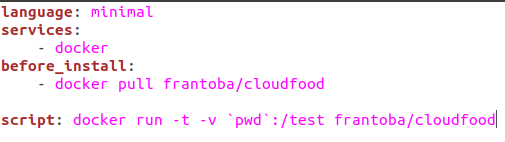
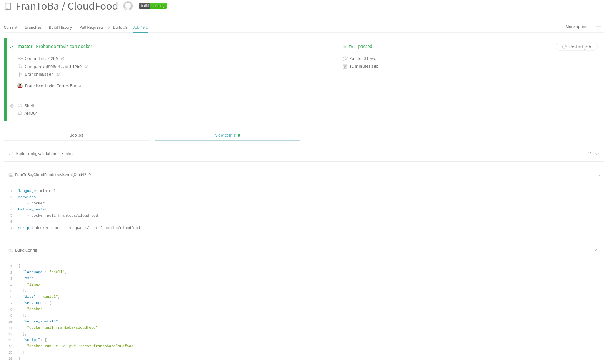

#  Aprovechamiento del contenedor de Docker en alguno de los sistemas de CI.

Vamos a aprovechar nuestro contenedor en el sistema Travis. Para ellos, debemos de modificar nuestro archivo .travis.yml. Este es el archivo antes de la reconfiguración:

Para utilizar nuestro contenedor, debemos indicar que el lenguaje a usar es minimal y docker como servicio. Tendremos que hacer pull de nuestra imagen y ejecutar la orden necesaria para ejecutar nuestros tests. Así quedaría el [fichero](../.travis.yml):

Como vemos, al hacer push a nuestro repositorio, travis utilizar docker para ejecutar nuestros tests:

