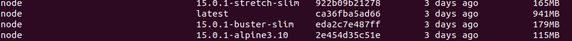

> Elección del contenedor base

Nuestro proyecto está basado en el lenguaje Javascript, asique por lo que dice la teoría, lo mejor será elegir una imagen basada en Node.
Las imagenes de docker compatibles (y más ligeras) con node que he probado son las siguientes:
- 15.0.1-alpine3.10
- 15.0.1-buster-slim
- 15.0.1-stretch-slim

Aquí podemos ver el tamaño y como vemos, la versión de alpine es la más ligera:

Los tiempos obtenidos al reconstruir las imágenes han sido los siguientes:
- 15.0.1-alpine3.10: 17s
- 15.0.1-buster-slim: 20s
- 15.0.1-stretch-slim: 19s

Por lo que vemos la versión de Alpine es la más ligera y la más rápida, por lo que será la que utilizaremos.

