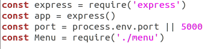
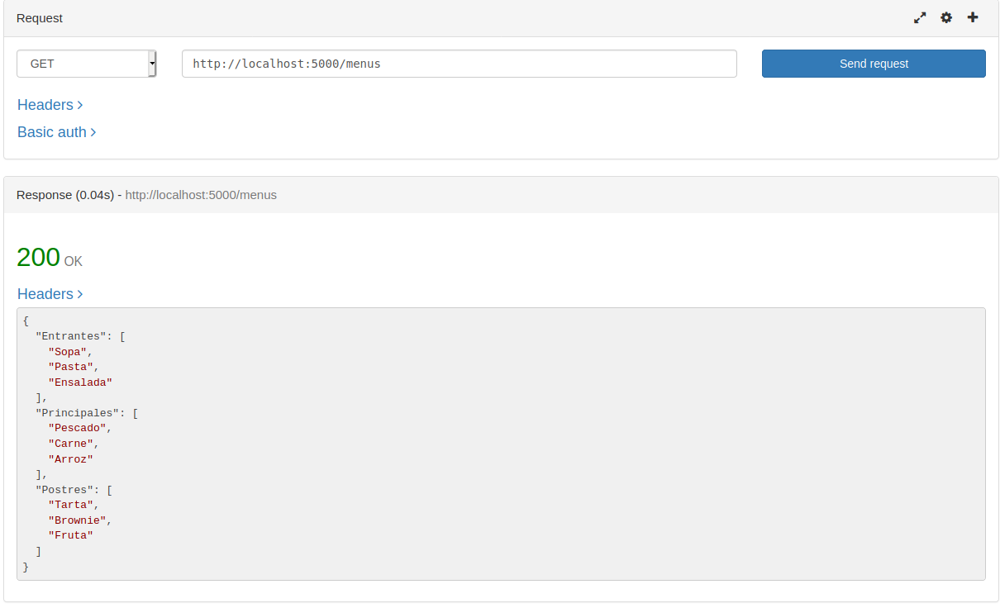
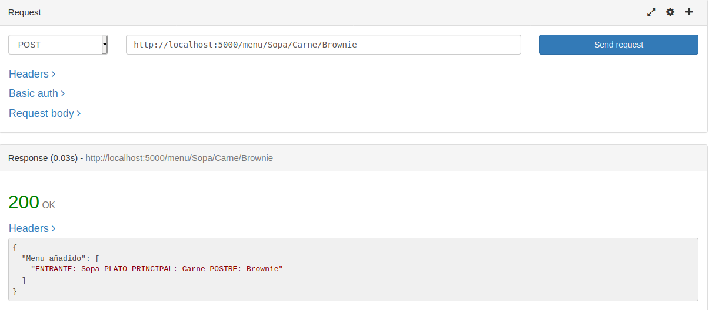
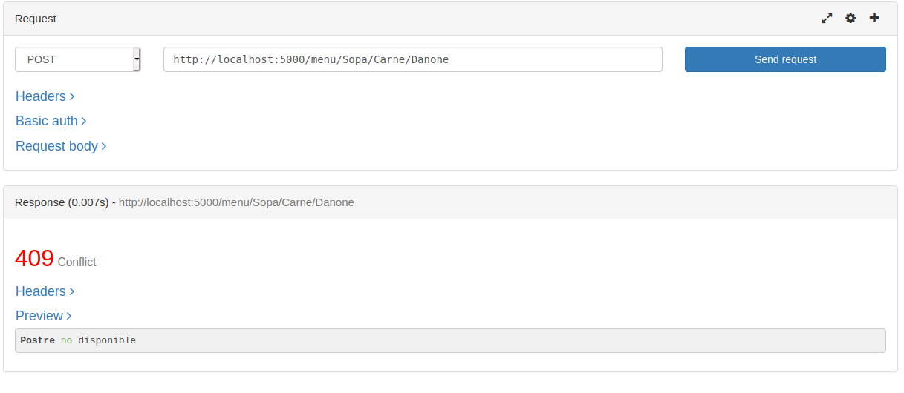
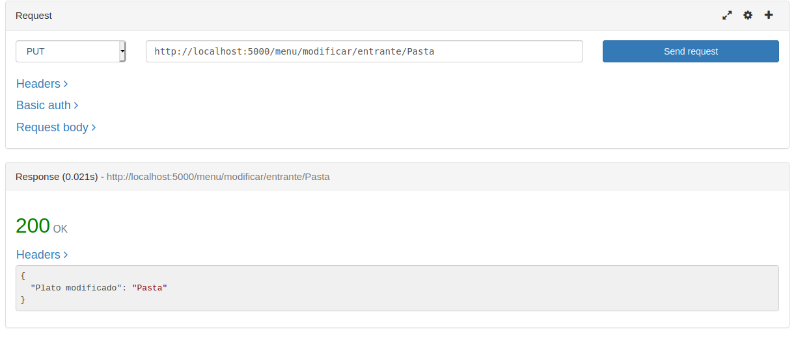
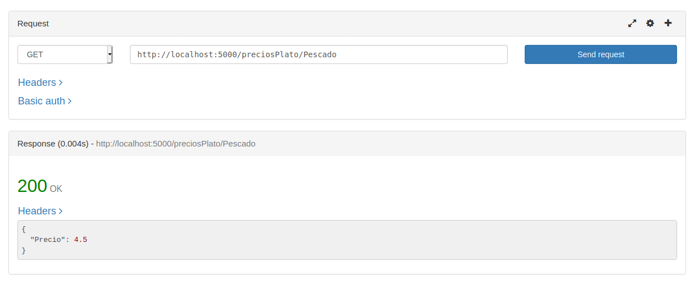
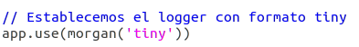
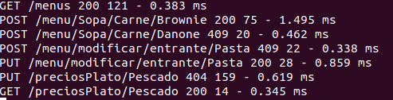

# API-REST 

Para nuestra API vamos a usar Express como hemos dicho anteriormente. Para ello hemos creado el fichero [index.js](../src/index.js), el cuál vamos a explicar paso a paso:

Para empezar incluimos el módulo de express y creamos la aplicación. Asignamos el puerto, 5000 en este caso, e incluimos nuestra clase menú.

Ahora, debemos crear las funciones encargadas de actuar con las peticios GET, POST o PUT (en este caso no he usado DELETE). 

Las primeras funciones implementadas tienen que ver con la [HU01: como usuario quiero consultar los menús disponibles](https://github.com/FranToBa/CloudFood/issues/2). Para ello se ha usado el método *get* y la ruta */menus*, devolviendo la lista de los platos disponibles en formato JSON(tambíen se pueden obtener indicando entrantes, principales o postres):

Para la [HU02: como usuario quiero seleccionar menú](https://github.com/FranToBa/CloudFood/issues/3) he usado *post* con la ruta */menu/:entrante?/:plato?/:postre?*. Recogemos los parámetros con req.params y comprobamos si están vacios (se añade la interrogación para que reconozca la ruta si falta alguno, y en ese caso notificar el error de argumentos). Si los argumentos son correctos, se llama a la función encargada de crear un menú y devolvemos OK.
Además se ha añadido otra ruta con *get* para consultar el menú seleccionado. 

Si probamos con un postre que no está disponible:

Para la [HU03: como usuario quiero modificar el menú seleccionado](https://github.com/FranToBa/CloudFood/issues/4), hemos usado *put* y la ruta */menu/modificar/:tipo/:plato*. Recogemos los parámetros y comprobamos si se han pasado los argumentos correctos y además si el tipo de plato indicado es correcto, si no devolvemos error de argumentos. Si los argumentos son correctos, modificamos el plato dependiendo del tipo de plato indicado.

Respecto a la [HU06: Como usuario quiero consultar el precio de los platos](https://github.com/FranToBa/CloudFood/issues/22), se han implementado 3 rutas con *get* diferentes: con */preciosCarta* podemos ver los precios de todos los platos, con */preciosCarta/:tipo* podemos ver los precios de los platos de tipo indicado y por último, con */preciosPlato/:plato* podemos ver el precio de un plato específico:

## Morgan como logger

Como middleware de log voy a usar Morgan, ya que consultando los middlwares de terceros de Express [aquí](https://expressjs.com/es/resources/middleware.html), ví que Morgan tenía un [repositorio](https://github.com/expressjs/morgan) en el que había buena información sobre su uso. Siguiendo los pasos de ese repositorio, lo instalamos e incluimos lo necesario en nuestro index.js.

Para el uso de Morgan, debemos incluir el módulo con:
~~~
var morgan = require('morgan')
~~~

Indicamos a nuesta app que use morgan, en este caso en formato 'tiny':

Esto mostrará el log por consola (stdout por defecto al llamar a morgan) con el formato:
~~~
:method :url :status :res[content-length] - :response-time ms
~~~

Aquí tenemos el ejemplo de su uso:

