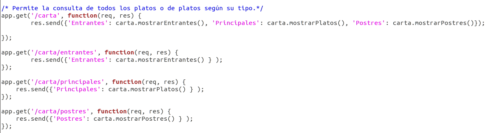

# API-REST 

Para nuestra API vamos a usar Express como hemos dicho anteriormente. Para ello hemos creado el fichero [index.js](../src/index.js), el cuál vamos a explicar paso a paso:

Para empezar incluimos el módulo de express y creamos la aplicación. Incluimos nuestra clase menú y añadimos los middlewares Body-parser y Etcd3 que explicaremos más tarde.

Ahora, debemos crear las funciones encargadas de actuar con las peticios GET, POST, PUT y DELETE. 

Para esta API, he creado un vector de Pedidos que recogerá los diferentes menús, ya que más adelante se incluirá una base de datos que nos servirá para esto. Los ids de los diferentes menús serán tratados como índices de "pedidos".

Las primeras funciones implementadas tienen que ver con la [HU01: como usuario quiero consultar los menús disponibles](https://github.com/FranToBa/CloudFood/issues/2). Para ello se ha usado el método *get* y la ruta */carta*, devolviendo la lista de los platos disponibles en formato JSON(tambíen se pueden obtener indicando entrantes, principales o postres):

Para la [HU02: como usuario quiero seleccionar menú](https://github.com/FranToBa/CloudFood/issues/3) he usado *put* con la ruta */menu/:entrante/:plato/:postre*. Recogemos los parámetros con req.params . Si los argumentos son correctos, creamos un nuevo menú, lo añadimos a los pedidos y devolvemos OK con el id correspondiente. Si algún plato no está disponible, devolvemos el error que devuelve nuestra función.
Además se ha añadido otra ruta con *get* para consultar el menú seleccionado. 

Para la [HU03: como usuario quiero modificar el menú seleccionado](https://github.com/FranToBa/CloudFood/issues/4), hemos usado *post* y la ruta */menu/:id*. Recogemos los parámetros (los parámetros a modificar los recogemos del body) y comprobamos los argumentos: si el id o el tipo no son correctos o si el plato no está disponible. Si los argumentos son correctos, modificamos el plato dependiendo del tipo de plato indicado.
Por otra parte, se ha incluido un DELETE que recoge el id y borra ese menú. Da error si no existe menú con ese id.

Respecto a la [HU06: Como usuario quiero consultar el precio de los platos](https://github.com/FranToBa/CloudFood/issues/22), se han implementado 3 rutas con *get* diferentes: con */carta/precios* podemos ver los precios de todos los platos, con */carta/precios/:tipo* podemos ver los precios de los platos de tipo indicado y por último, con */preciosPlato/:plato* podemos ver el precio de un plato específico:

## Middlewares

Para empezar vamos a hablar sobre la función middleware que he creado para el log:

En esta función decimos a nuestra app que muestre por consola la fecha, el método usado, la url y el estado de respuesta.

También se ha usado body-parser como middleware para poder recoger los datos del body para el POST. Para ello hemos indicado a nuestra app que acepte datos JSON y urlencoded.

### ETCD

Por útimo, se ha usado etcd configuración distribuida. Se ha usado de forma sencilla, en un nuevo archivo [server.js](../src/server.js) que se usaría para arrancar el servidor. En este código establecemos el puerto de nuestro servidor de forma que si existe una variable de entorno "port" se usa esa y si no, se usa la 5000 por defecto.

