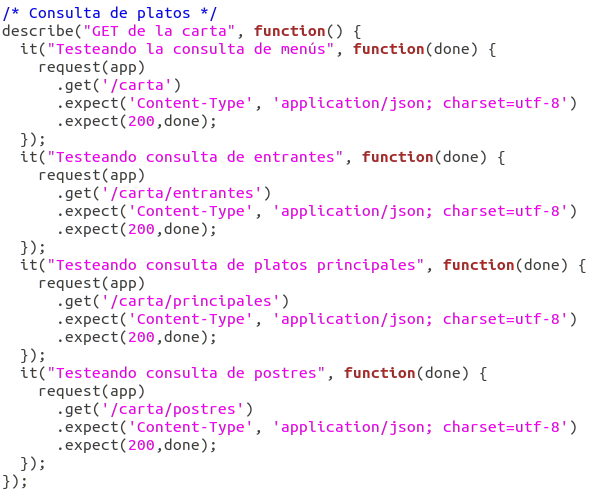

# Tests para nuestra API-REST

Para nuestros tests vamos a usar *supertest*. Para ello, incluimos el módulo de supertest despues de haberlo instalado con npm, además incluimos también nuestra clase menu.js y nuestra app.

El proceso que vamos a seguir para la realización de los tests es el siguiente:
Realizamos la petición indicando GET, POST, PUT o DELETE con la ruta, si esperamos que el resultado sea "OK", comprobamos que el tipo devuelto sea JSON y el estado 200. Si esperamos un error, esperamos el estado del error correspondiente.

Test para la consulta de platos: [HU01: como usuario quiero consultar los menús disponibles](https://github.com/FranToBa/CloudFood/issues/2):

Test para la creación de un menú y consulta del mismo: [HU02: como usuario quiero seleccionar menú](https://github.com/FranToBa/CloudFood/issues/3). Si introducmos un plato no válido -> error400. 

Test para la modificación de un menú o borrado: [HU03: como usuario quiero modificar el menú seleccionado](https://github.com/FranToBa/CloudFood/issues/4). Comprobamos los errores si el tipo no existe, el plato no está disponible o el id no corresponde a ningún menú:

Test obtener los precios de los platos (todos los platos o según su tipo) o de un plato específico: [HU06: Como usuario quiero consultar el precio de los platos](https://github.com/FranToBa/CloudFood/issues/22). Error si el tipo no existe:

