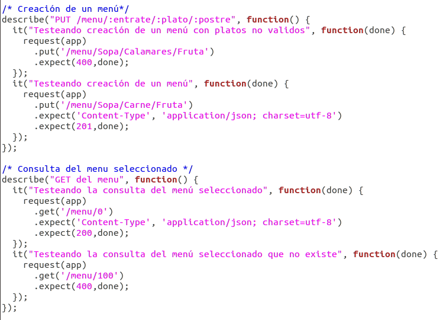
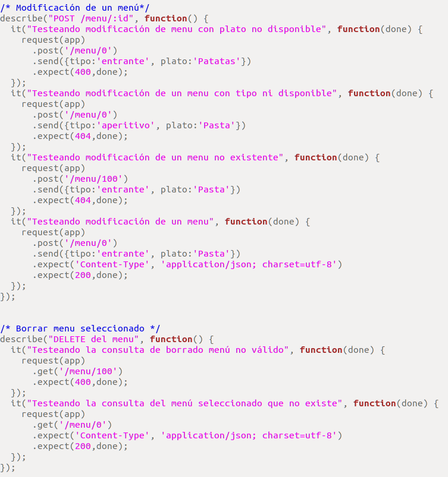

# Tests para nuestra API-REST

Para nuestros tests vamos a usar *supertest*. Para ello, incluimos el módulo de supertest despues de haberlo instalado con npm, además incluimos también nuestra clase menu.js y nuestra app.

El proceso que vamos a seguir para la realización de los tests es el siguiente:
Realizamos la petición indicando GET, POST o PUT con la ruta, si esperamos que el resultado sea "OK", comprobamos que el tipo devuelto sea JSON y el estado 200. Si esperamos un error, esperamos el estado del error correspondiente.

Test para la consulta de platos:

Test para la creación de un menú. Si introducmos un plato no válido -> error409 y si no introducimos todos los platos necesarios -> error400. También se prueba la devolución del menú seleccionado:

Test para la modificación de un menú. Comprobamos los errores si el tipo no existe o el plato no está disponible:

Test obtener los precios de los platos (todos los platos o según su tipo). Error si el tipo no existe:

Test obtener los precios de un plato específico. Error si el plato no existe o no se indica plato:

