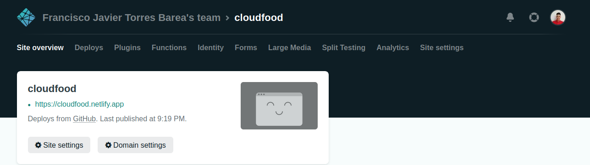
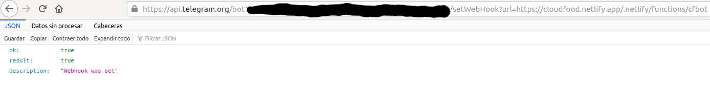
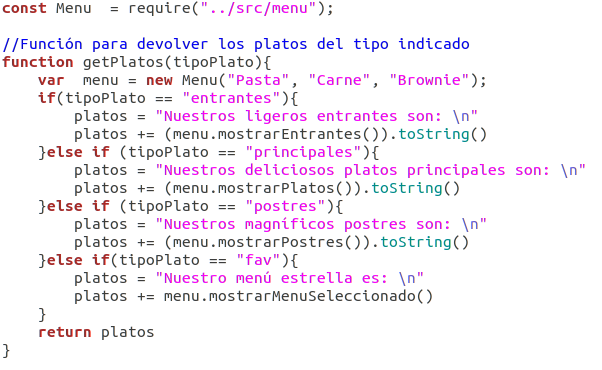
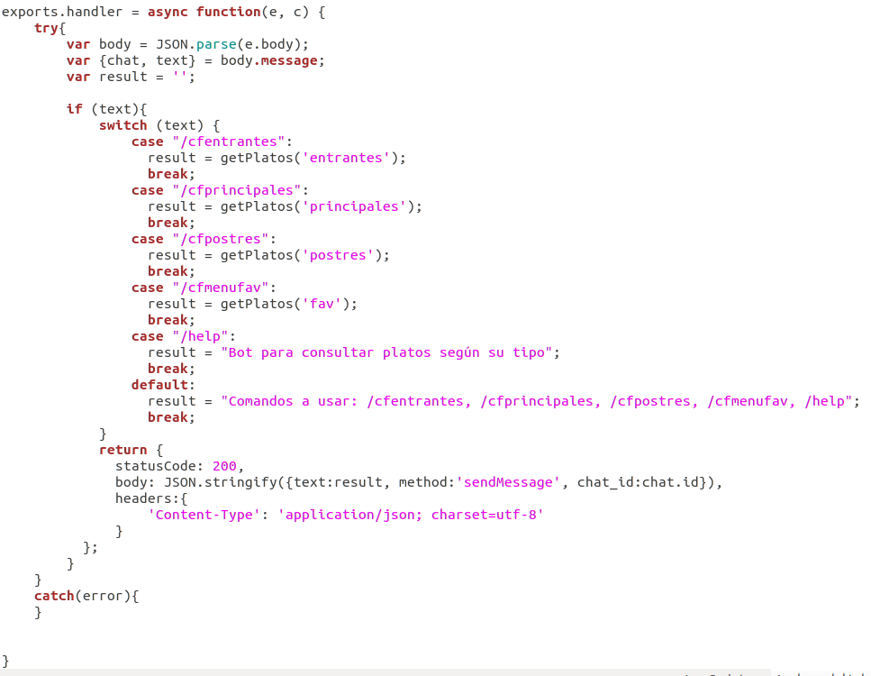
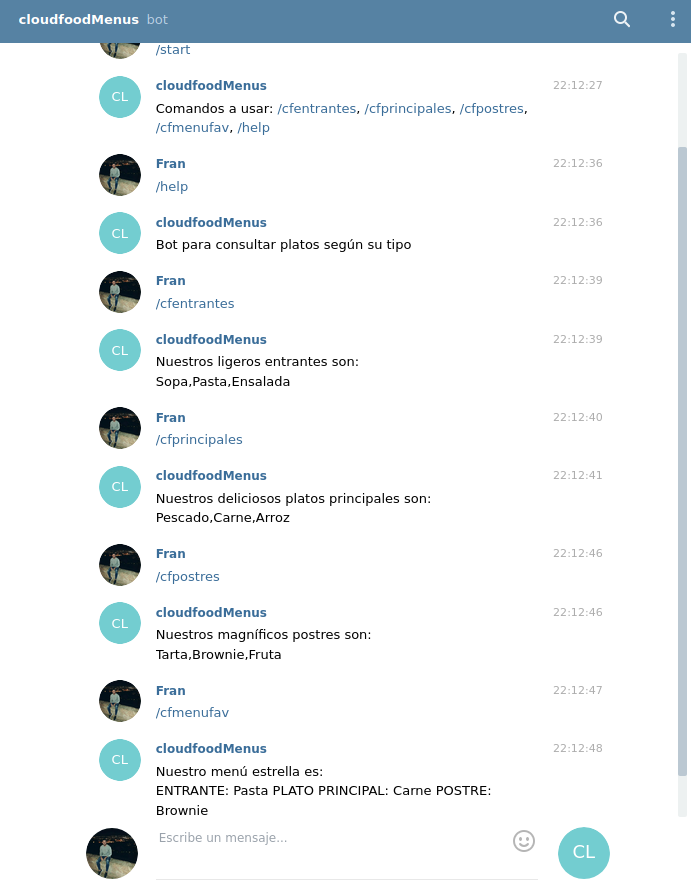

> Bot en Netlify

Como segunda plataforma de despliegue voy a usar Netlify. Las principal razón para elegir esta plataforma es la facilidad que te da para conectar tu repositorio con la plataforma y la gran cantidad de [información](https://docs.netlify.com/) que te ofrece para hacer un despliegue.

Para empezar, nos logueamos con nuestra cuenta de github e importamos nuestro repositorio.

En nuestra terminal debemos tener instalada la cli de netlify. Desplegamos nuestro proyecto linkeando con el repositorio importado anteriormente. Las órdenes para estos pasos son las siguientes:
~~~
$ npm install -g netlify-cli
$ netlify login
$ netlify deploy
$ netlify deploy --prod
~~~

En nuestro proyecto creamos una carpeta [functions](../functions) en la que tendremos nuestra función. En el archivo [netlify.toml](../netlify.toml) indicamos que esta carpeta será la que usaremos para el build.

## Bot de consulta de platos según su tipo

Para crear nuestro bot hablamos con el bot father para crearlo y obtener su token. Para nuestro boot usaremos un webhook, para que cada vez que llegue un mensaje se active y llame a la función definida. Para establecer el webhook, usamos la url **https://api.telegram.org/botTOKEN_BOT/setWebHook?url=URL_NETLIFY**.

El código del bot lo encontramos en el archivo [cfbot.js](../functions/cfbot.js). 
Para la creación del bot voy a seguir la [HU01: como usuario quiero consultar los menús disponibles](https://github.com/FranToBa/CloudFood/issues/2). Para ello, he creado la siguiente función encargada de llamar a los métodos del menú para devolver los platos dsiponibles dependiendo de si son entrantes, principales o postres. También devuelve un menú específico calificado como nuestro menú estrella.

A continuación llamamos a la función **exports.handler = async function(event, context)** que se encarga de obtener los datos del evento y mandar posteriormente una respuesta. Cuando el webhook activa la función, obtenemos los datos a través del **event.body**. Esto nos permite obtener el chat.id y el mensaje enviado. Ahora dependiendo del mensaje que se haya enviado, damos una respuesta usando la función definida anteriormente pasandole como argumento lo que indique el mensaje. Por último devolvemos el mensaje que hemos creado usando el chat.id obtenido y con estado 200 (estándar para HTTP con éxito).

### Demostración

Este bot puede ser probado [aquí](t.me/cloudfoodMenus_bot).

