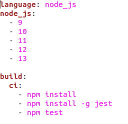
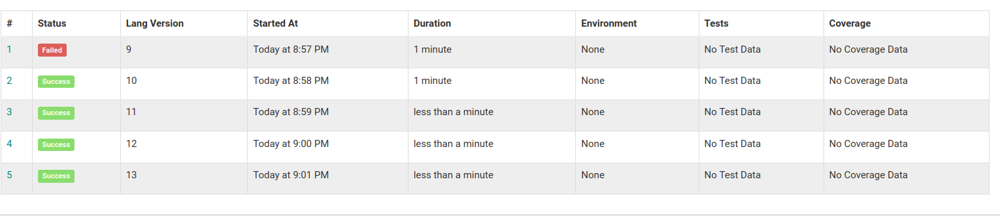

# Configuración de algún sistema de integración continua adicional: CircleCI.

Como sistema adicional he elegido Shippable por su parecido a Travis. Puedes acceder a shippable con tu cuenta de GItHub y asociar tus repositorios de manera sencilla. Además, su archivo de configuración es tan sencillo como el de travis.

- Para registranos, podemos entrar a través de nuestra cuenta de GitHub.
- Desde subscripciones, podemos ver nuestros repositorios de GitHub y seleccionamos el de este proyecto.
- Añadimos el archivo de configuración pra shippable. Como vemos, es muy parecido al de travis. Indicamos el lenguaje, las versiones que queremos probar (en este caso he probado las mismas que con travis), e indicamos las ordenes a ejeccutar:

Como vemos, ha fallado la misma versión que en Travis. La ejecución ha tardado bastante más, pero no algo exagerado. En la imagen podemos ver que el tiempo total ha sido alrededor de 5 minutos.

