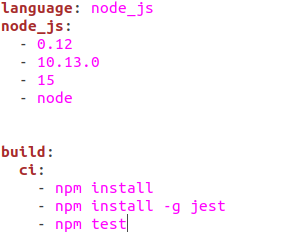

# Configuración de algún sistema de integración continua adicional: SHIPPABLE.

Como sistema adicional he elegido Shippable por su parecido a Travis. Puedes acceder a shippable con tu cuenta de GItHub y asociar tus repositorios de manera sencilla. Además, su archivo de configuración es tan sencillo como el de travis.

- Para registranos, podemos entrar a través de nuestra cuenta de GitHub.
- Desde subscripciones, podemos ver nuestros repositorios de GitHub y seleccionamos el de este proyecto.
- Añadimos el archivo de configuración pra shippable. 

En este archivo, tenemos diferentes partes:
- Lenguaje: en este caso usaremos node.
- Versiones que utilizaremos. Más abajo justificamos estas versiones.
- Build: instalación necesaria de dependencias y de jest, para ejecutar los tests.

- Las versiones usadas son las siguientes:

	- La version 0.12 que es de las versiones más antiguas. Esta versión ha fallado, algo esperado al ser tan antigua.
	- La versión 10.13.0, por probar una versión intermedia.
	- La versión 11, para ver que travis usa la más actual de esta versión. Aquí usa la 11.15.0.
	
	- Node, que utiliza la última versión. En este caso utiliza la 15.
	
