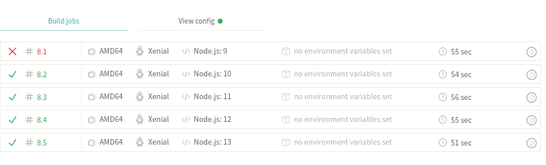

# Integración continua

En esta sección, añadiremos un sistema de integración continua, con el fin de ejecutar pruebas de todo un proyecto. Gracias a la integración continua podremos detectar fallos lo antes posbile

## Travis

El sistema que voy a utilizar es Travis, ya que guarda relación con github y se puede comprobar si se pasan los tests solo con hacer push. Además, Travis es un sistema de código abierto muy popular.

Para su configuración, debemos registrarnos en su sistema enlazandolo con nuestra cuenta de github. Después, añadir el fichero travis.yml a nuestro directorio. Estos pasos podemos verlos en los [ejercicios de autoevaluación](https://github.com/FranToBa/Autoevaluacion-IV/blob/main/docs/s6.md).

Nuestro fichero va a constar de 4 partes: el lenguaje, las versiones a utilizar, las ordenes necesarias antes del install y la orden a ejecutar. Vamos a probar las versiones de node de la 9 a la 13.

Dese github, podemos ver que se están realizando los tests al hacer un push.

En la CI de de Travis, podemos ver la ejecución de las diferentes versiones. La versión 9 ha fallado, por lo que usaremos versiones más actuales que no han fallado.

Cuando hacemos push, Travis ejecuta la orden que hemos indicado en el archivo .travis.yml, que en este caso es la realización de nuestros tests:

