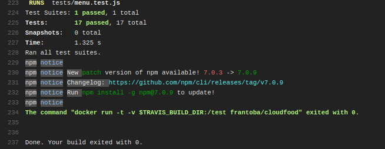

# Integración continua

En esta sección, añadiremos un sistema de integración continua, con el fin de ejecutar pruebas de todo un proyecto. Gracias a la integración continua podremos detectar fallos lo antes posbile

## Travis

El sistema que voy a utilizar es Travis, ya que guarda relación con github y se puede comprobar si se pasan los tests solo con hacer push. Además, Travis es un sistema de código abierto muy popular.

Para su configuración, debemos registrarnos en su sistema enlazandolo con nuestra cuenta de github. Después, añadir el fichero travis.yml a nuestro directorio. Estos pasos podemos verlos en los [ejercicios de autoevaluación](https://github.com/FranToBa/Autoevaluacion-IV/blob/main/docs/s6.md).

Dese github, podemos ver que se están realizando los tests al hacer un push.

Nuestro fichero va a constar de 2 partes:

- El lenguaje: en este caso usamos minimal, que ya incluye docker, por lo que no tenemos que indicar que usaremos docker como servicio.
- Script: en este caso indicaremos que use nuestro condenedor con la variable $TRAVIS-BUILD_DIR, la cual nos da el path absoluto al directorio de trabajo donde ha sido copiada la construcción del repositorio. Información de esta variable [consultada aquí](https://docs.travis-ci.com/user/environment-variables/).

Accediendo al CI de Traivs, podemos ver la ejecución:

Con el script ejecutado, no encontrará la imagen, pero travis la descargará automáticamente. Por ello, podemos omitir la línea donde se hacía docker pull frantoba/cloudfood. Como vemos, en el job log se encuentran las siguientes líneas:
~~~
$ docker run -t -v $TRAVIS_BUILD_DIR:/test frantoba/cloudfood
Unable to find image 'frantoba/cloudfood:latest' locally
latest: Pulling from frantoba/cloudfood

Status: Downloaded newer image for frantoba/cloudfood:latest
~~~

