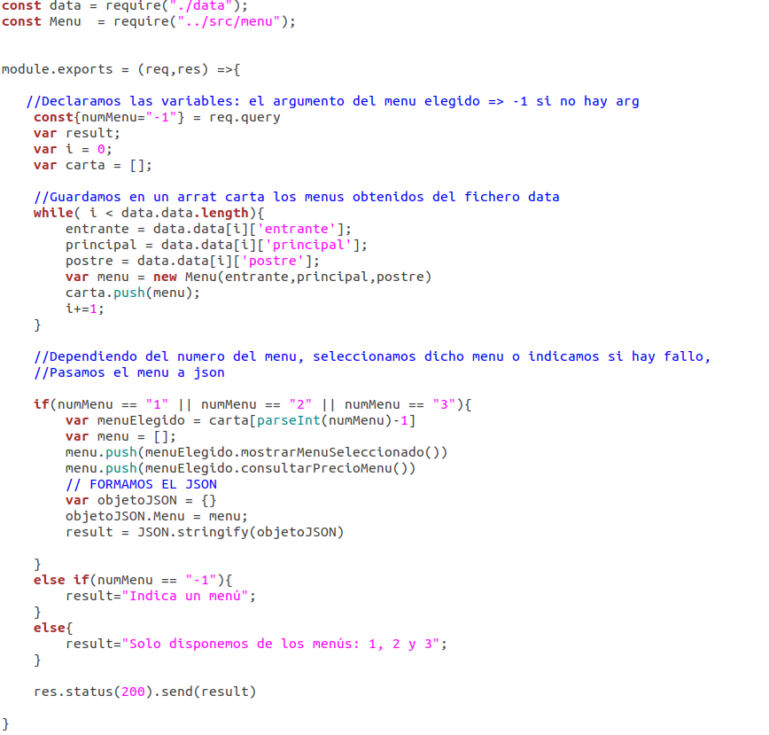

> Despliegue continuo

Para este despliegue voy a usar Vercel porque su uso es bastante sencillo ya que te van guiando a través de los pasos. Siguiendo estos pasos nos logueamos con nuestro usuario de github e importamos nuestro proyecto.

Para el despliegue, instalamos la cli de vercel e indicamos las siguientes ordenes:

Con el comando *vercel*, seleccionamos nuestro repositorio y lo linkeamos. 
Con *vercel --prod*, mandamos a producción.

Como podemos leer en los pasos que te da Vercel, debemos crear en nuestro repositorio [una carpeta api](../api). Ahí debemos incluir nuestro código para la puesta en marcha de nuestra función.

## API

Se ha incluido una api en la que realizamos una función que devuelve los platos del menú seleccionado y su precio ([HU02](https://github.com/FranToBa/CloudFood/issues/3) y [HU7](https://github.com/FranToBa/CloudFood/issues/42)). Se ha usado el fichero de datos con los menús [data.js](../api/data.js) y el código es [seleccionmenu.js](../api/seleccionmenu.js).

Como podemos ver en nuestro código, creamos los menús a través de los datos proporcionados por el fichero data. Obtenemos el argumento a través de *req.query*. Dependiendo del tipo de menú introducido como argumento llamamos a nuestro método para mostrar un menú y al método para mostrar su precio, creando el JSON. Si no hay argumento o no es válido, indicar que se debe hacer. Enviamos (*send*) nuestra respuesta (*res*)  con código (*status*) 200 (estándar para HTTP con éxito) y el resultado de nuestra función en forma de string.

Como podemos ver en la siguiente imagen, si accedemos a la url proporcionada por vercel y añadimos nuestro argumento, el resultado es el esperado:

 La [url](https://cloud-food.vercel.app/api/seleccionmenu.js?numMenu=1) está en el fichero [../iv.yaml](./iv.yaml) y el resultado en [5.json](../5.json).

